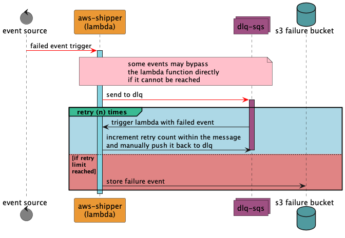
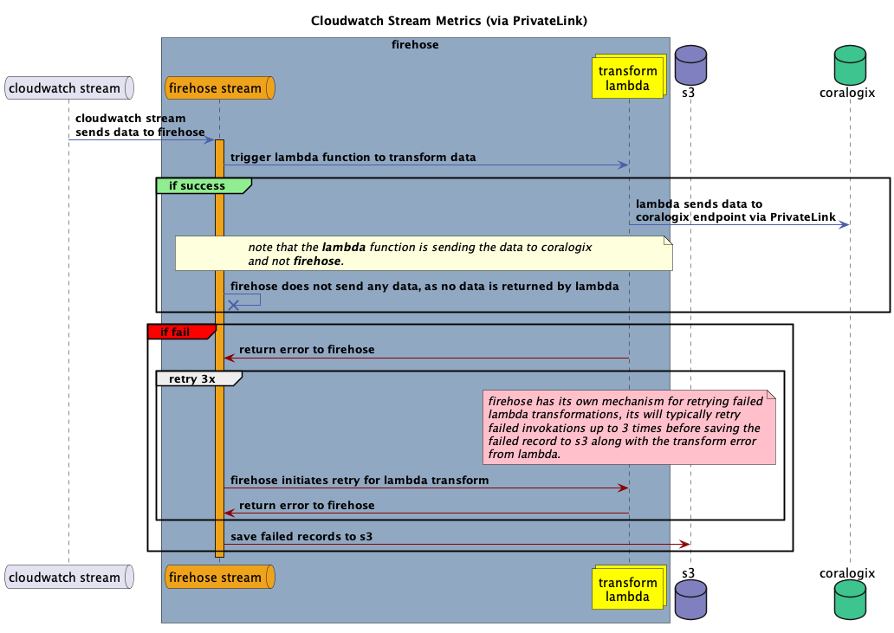

# Forward AWS Logs via Lambda Shipper

[](https://raw.githubusercontent.com/coralogix/coralogix-aws-shipper/master/LICENSE)   [](https://rust-reportcard.xuri.me/report/github.com/coralogix/coralogix-aws-shipper) 

[//]: # (delete)

1. [Overview](#overview)
2. [Supported Services](#supported-services)
   - [Amazon S3, CloudTrail, VPC Flow Logs and more](#amazon-s3-cloudtrail-vpc-flow-logs-and-more)
   - [Amazon SNS/SQS](#amazon-snssqs)
   - [Amazon CloudWatch](#amazon-cloudwatch)
   - [Amazon Kinesis](#amazon-kinesis)
   - [Amazon MSK & Kafka](#amazon-msk--kafka)
   - [Amazon ECR Image Security Scan](#amazon-ecr-image-security-scan)
3. [Deployment Options](#deployment-options)
   - [Integrate using the Coralogix Platform (Recommended)](#integrate-using-the-coralogix-platform-recommended)
   - [Quick Create a CloudFormation Stack](#quick-create-a-cloudformation-stack)
   - [Deploy the AWS Serverless Application](#deploy-the-aws-serverless-application)
   - [Terraform Module](#terraform-module)
4. [Configuration Parameters](#configuration-parameters)
   - [Universal Configuration](#universal-configuration)
   - [S3/CloudTrail/VpcFlow/S3Csv Configuration](#s3cloudtrailvpcflows3csv-configuration)
   - [CloudWatch Configuration](#cloudwatch-configuration)
   - [SNS Configuration](#sns-configuration)
   - [SQS Configuration](#sqs-configuration)
   - [Kinesis Configuration](#kinesis-configuration)
   - [Kafka Configuration](#kafka-configuration)
   - [MSK Configuration](#msk-configuration)
   - [Generic Configuration (Optional)](#generic-configuration-optional)
   - [Lambda Configuration (Optional)](#lambda-configuration-optional)
   - [VPC Configuration (Optional)](#vpc-configuration-optional)
   - [Metadata](#metadata)
   - [Advanced Configuration](#advanced-configuration)
   - [DLQ](#dlq)
5. [Troubleshooting](#troubleshooting)
6. [Cloudwatch Metrics Stream via Firehose for PrivateLink (beta)](#cloudwatch-metrics-streaming-via-privatelink-beta)
7. [Support](#support)

[//]: # (/delete)

## Overview

This integration guide focuses on connecting your AWS environment to Coralogix using AWS Lambda functions. To complete this integration, you may either use the Coralogix platform UI, CloudFormation templates from AWS, AWS SAM applications, or a dedicated Terraform module from our [GitHub repository](https://github.com/coralogix/terraform-coralogix-aws/tree/master/modules/coralogix-aws-shipper).

This document details how to complete our predefined Lambda function template to simplify the integration. Your task will be to provide specific configuration parameters, based on the service that you intend to connect to. The reference list for these parameters is provided below.

!!! note

    As we improve `coralogix-aws-shipper`, we invite you to contribute, ask questions, and report issues in the repository.

## Supported services

While `coralogix-aws-shipper` manages integrations for all listed AWS products, some parameters are specific to individual products. Please refer to the [Configuration parameters](#configuration-parameters) for product-specific requirements.

### Amazon S3, CloudTrail, VPC Flow Logs and more

This integration is based on S3. Your Amazon S3 bucket can receive log files from all kinds of services, such as [CloudTrail](https://docs.aws.amazon.com/awscloudtrail/latest/userguide/cloudtrail-log-file-examples.html), [VPC Flow Logs](https://docs.aws.amazon.com/vpc/latest/userguide/flow-logs-s3.html), [Redshift](https://docs.aws.amazon.com/redshift/latest/mgmt/db-auditing.html#db-auditing-manage-log-files), [Network Firewall](https://docs.aws.amazon.com/network-firewall/latest/developerguide/logging-s3.html) or different types of load balancers ([ALB](https://docs.aws.amazon.com/elasticloadbalancing/latest/application/load-balancer-access-logs.html)/[NLB](https://docs.aws.amazon.com/elasticloadbalancing/latest/network/load-balancer-access-logs.html)/[ELB](https://docs.aws.amazon.com/elasticloadbalancing/latest/classic/access-log-collection.html)). The data is then sent to Coralogix for analysis.

You can also incorporate SNS/SQS into the pipeline to trigger the integration upon notification.

### Amazon SNS/SQS

A separate integration for SNS or SQS is available. You can receive messages directly from both services to your Coralogix subscription. You will need the ARN of the individual SNS/SQS topic.

### Amazon CloudWatch

Coralogix can be configured to receive data directly from your [CloudWatch](https://docs.aws.amazon.com/cloudwatch/) log group.

### Amazon Kinesis

Coralogix can be configured to receive data directly from your [Kinesis Stream](https://docs.aws.amazon.com/cloudwatch/).

### Amazon MSK & Kafka

Coralogix can be configured to receive data directly from your [MSK](https://docs.aws.amazon.com/msk/) or [Kafka](https://docs.aws.amazon.com/lambda/latest/dg/with-kafka.html) cluster.

### Amazon ECR image security scan

Coralogix can be configured to receive ECR [Image Scanning](https://docs.aws.amazon.com/AmazonECR/latest/userguide/image-scanning.html).

## Deployment options

**Important:** Before you begin, make sure your AWS user has the necessary permissions to create Lambda functions and IAM roles.

### Integrate using the Coralogix platform (recommended)

The fastest way to deploy your predefined Lambda function is from within the Coralogix platform. Fill out an integration form and confirm the integration from your AWS account. Product integrations can be done by navigating to **Data Flow** > **Integrations** in your Coralogix toolbar. For detailed UI instructions, please read the [Integration Packages](https://coralogix.com/docs/integration-packages/) tutorial.

### Quick Create a CloudFormation stack

You can always launch the CloudFormation stack by filling out a Quick Create template. This is done from within your AWS Management Console. Log into your AWS account and click the button below to deploy the CloudFormation stack.

[](https://console.aws.amazon.com/cloudformation/home#/stacks/create/review?stackName=coralogix-aws-shipper&templateURL=https://cgx-cloudformation-templates.s3.amazonaws.com/aws-integrations/aws-shipper-lambda/template.yaml)

If you are using AWS CLI, you can use a [CloudFormation template](https://github.com/coralogix/cloudformation-coralogix-aws/tree/master/aws-integrations/aws-shipper-lambda) from our repository.

### Deploy the AWS serverless application

Alternatively, you can use the [SAM deployment link](https://serverlessrepo.aws.amazon.com/applications/eu-central-1/597078901540/coralogix-aws-shipper). The procedure is very similar to filling out the Quick Create template.

### Terraform module

If you are using Terraform to launch your infrastructure, you can access `coralogix-aws-shipper` it via our [Terraform Module](https://github.com/coralogix/terraform-coralogix-aws/tree/master/modules/coralogix-aws-shipper). Use the parameters defined in the repository README, as they more accurately reflect the configuration process.

## Configuration parameters

This document explains the basic config options for your template. You will need these values to launch your integration. For additional optional parameters, view the [Advanced configuration](#advanced-configuration) options.

Use the tables below as a guide to configure your deployment. The configuration variables provided apply to Serverless or CloudFormation deployments. If you plan to use Terraform, the variable requirements differ slightly. Please refer to the [Terraform Module](https://github.com/coralogix/terraform-coralogix-aws/tree/master/modules/coralogix-aws-shipper) for further details.

### Universal configuration

Use an existing Coralogix [Send-Your-Data API key](https://coralogix.com/docs/send-your-data-management-api/) to make the connection or create one as you fill our pre-made template. Additionally, make sure your integration is [Region-specific](https://coralogix.com/docs/coralogix-domain/).

!!! note

    Always deploy the AWS Lambda function in the same AWS region as your resource, such as the S3 bucket.

| Parameter                    | Description                                                                                                                                                                                                                                                                                                                        | Default Value | Required           |
|------------------------------|------------------------------------------------------------------------------------------------------------------------------------------------------------------------------------------------------------------------------------------------------------------------------------------------------------------------------------|---------------|--------------------|
| Application name             | This will also be the name of the CloudFormation stack that creates your integration. It can include letters (A–Z and a–z), numbers (0–9) and dashes (-).                                                                                                                                                                          |               | :heavy_check_mark: |
| IntegrationType              | Choose the AWS service that you wish to integrate with Coralogix. Can be one of: S3, CloudTrail, VpcFlow, CloudWatch, S3Csv, SNS, SQS, CloudFront, Kinesis, Kafka, MSK, EcrScan.                                                                                                                                                   | S3            | :heavy_check_mark: |
| CoralogixRegion              | Your data source should be in the same region as the integration stack. You may choose from one of [the default Coralogix regions](https://coralogix.com/docs/coralogix-domain/): [Custom, EU1, EU2, AP1, AP2, US1, US2]. If this value is set to Custom, you must specify the Custom Domain to use via the CustomDomain parameter. | Custom        | :heavy_check_mark: |
| CustomDomain                 | If you choose a custom domain name for your private cluster, Coralogix will send telemetry from the specified address (e.g. custom.coralogix.com).                                                                                                                                                                                 |               |                    |
| ApplicationName              | The name of the application for which the integration is configured. [Advanced configuration](#advanced-configuration) specifies dynamic value retrieval options.                                                                                                                                                                  |               | :heavy_check_mark: |
| SubsystemName                | Specify the [name of your subsystem](https://coralogix.com/docs/application-and-subsystem-names/). For a dynamic value, refer to the Advanced configuration section. For CloudWatch, leave this field empty to use the log group name.                                                                                             |               | :heavy_check_mark: |
| ApiKey                       | The Send-Your-Data [API key](https://coralogix.com/docs/send-your-data-api-key/) validates your authenticity. This value can be a direct Coralogix API key or an AWS Secret Manager ARN containing the API Key.<br>*Note that the parameter expects the API key in plain text or stored in a secret manager.*                          |               | :heavy_check_mark: |
| StoreAPIKeyInSecretsManager  | Enable this to store your API key securely. Otherwise, it will remain exposed in plain text as an environment variable in the Lambda function console.                                                                                                                                                                             | True          | :heavy_check_mark: |
| ReservedConcurrentExecutions | The number of concurrent executions that are reserved for the function, leave empty so the Lambda will use unreserved account. concurrency.                                                                                                                                                                                         | n/a           |                    |
| LambdaAssumeRoleARN          | A role that the Lambda will assume, leave empty to use the default permissions.<br> Note that if this parameter is used, all **S3** and **ECR** API calls from the Lambda will be made with the permissions of the assumed role.                                                                                                   |               |                    |
| ExecutionRoleARN             | The ARN of a user defined role that will be used as the execution role for the Lambda function.                                                                                                                                                                                                                                     |               |                    |

!!! note

    `EcrScan` doesn't require any additional configuration.

#### Working with roles

In some cases, specialized or more refined IAM permissions are required. The AWS Shipper supports granular IAM control through two parameters:

- **LambdaAssumeRoleARN**: Specifies a role ARN, enabling the Lambda function to assume the role. The assumed role will only affect S3 and ECR API calls, as these are the only services invoked by the Lambda function at the code level.

- **ExecutionRoleARN**: Specifies the execution role for the AWS Shipper Lambda. The provided role must have basic Lambda execution permissions. Any additional permissions required for the Lambda’s operation will be automatically added during deployment.

Basic Lambda execution role permission:

```yaml
        Statement:
          - Effect: "Allow"
            Principal:
              Service: "lambda.amazonaws.com"
            Action: "sts:AssumeRole"
```

### S3, CloudTrail, VpcFlow, S3Csv, CloudFront configuration

This is the most flexible type of integration, as it is based on receiving log files to Amazon S3. First, your bucket can receive log files from all kinds of other services, such as CloudTrail, VPC Flow Logs, Redshift, Network Firewall or different types of load balancers (ALB/NLB/ELB). Once the data is in the bucket, a pre-made Lambda function will then transmit it to your Coralogix account.

!!! note

    The S3 integration supports generic data. You can ingest any generic text, JSON, and CSV data stored in your S3 bucket.

**Maintain S3 notifications via SNS or SQS**

If you don’t want to send data directly as it enters S3, you can also use SNS/SQS to maintain notifications before any data is sent from your bucket to Coralogix. For this, you need to set the `SNSTopicArn` or `SQSTopicArn` parameters.

!!! note

    All resources, such as S3 or SNS/SQS, should be provisioned already. If you are using an S3 bucket as a resource, please make sure it is clear of any Lambda triggers located in the same AWS region as your new function.

| Parameter      | Description                                                                                                                                                                                       | Default Value                            | Required           |
|----------------|---------------------------------------------------------------------------------------------------------------------------------------------------------------------------------------------------|------------------------------------------|--------------------|
| S3BucketName   | Comma-separated list of names for the AWS S3 buckets that you want to monitor.                                                                                                                                   |                                          | :heavy_check_mark: |
| S3KeyPrefix    | Specify the prefix of the log path within your S3 bucket. This value is ignored if you use the `SNSTopicArn/SQSTopicArn` parameter.                                                                 | CloudTrail/VpcFlow 'AWSLogs/'            |                    |
| S3KeySuffix    | Filter for the suffix of the file path in your S3 bucket. This value is ignored if you use the `SNSTopicArn/SQSTopicArn` parameter.                                                                 | CloudTrail '.json.gz', VpcFlow '.log.gz' |                    |
| NewlinePattern | Enter a regular expression to detect a new log line for multiline logs. For example, \n(?=\d{2}-\d{2}\s\d{2}:\d{2}:\d{2}.\d{3}).                                                                         |                                          |                    |
| SNSTopicArn    | The ARN for the SNS topic that contains the SNS subscription responsible for retrieving logs from Amazon S3.                                                                                      |                                          |                    |
| SQSTopicArn    | The ARN for the SQS queue that contains the SQS subscription responsible for retrieving logs from Amazon S3.                                                                                      |                                          |                    |
| CSVDelimiter   | Specify a single character to be used as a delimiter when ingesting a CSV file with a header line. This value is applicable when the S3Csv integration type is selected, such as, “,” or ” “. | ,                                        |                    |

### CloudWatch configuration

Coralogix can be configured to receive data directly from your CloudWatch log group. CloudWatch logs are streamed directly to Coralogix via Lambda. This option does not use S3. You must provide the log group name as a parameter during setup.

| Parameter                | Description                                                                                                                                                                                                                                                                                                                                           | Default Value | Required           |
|--------------------------|-------------------------------------------------------------------------------------------------------------------------------------------------------------------------------------------------------------------------------------------------------------------------------------------------------------------------------------------------------|---------------|--------------------|
| CloudWatchLogGroupName   | Provide a comma-separated list of CloudWatch log group names to monitor. For example, (`log-group1`, `log-group2`, `log-group3`).                                                                                                                                                                                                                     |               | :heavy_check_mark: |
| CloudWatchLogGroupPrefix | This parameter expects a string of comma-separated list, of log group prefixes. The code will use these prefixes to create permissions for the Lambda instead of creating for each log group permission it will use the prefix with a wild card to give the Lambda access for all of the log groups that start with these prefix. This parameter doesn't replace the `CloudWatchLogGroupName` parameter. For more information, refer to the Note below.  |               |                    |

If your log group name is longer than 70, the Lambda function you will see the permission for that log group as: `allow-trigger-from-<the log group first 65 characters and the last 5 characters>`. This is because of length limit in AWS for permission name.

!!! note

    The `CloudWatchLogGroupName` parameter will get a list of log groups and then add them to the Lambda as triggers, each log group will also add permission to the Lambda, in some cases when there are a lot of log groups this will cause an error because the code 
    tries to create too many permissions for the Lambda (AWS have a limitation for the number of permission that you can have for a Lambda), and this is why we have the CloudWatchLogGroupPrefix parameter, this parameter will add only permission to the Lambda 
    using a wildcard( * ).for example, in case I have the log groups: log1,log2,log3 instead that the code will create for each of the log group permission to trigger the shipper Lambda then you can set `CloudWatchLogGroupPrefix = log`, and then it will create 
    only 1 permission for all of the log groups to trigger the shipper Lambda, but you will still need to set `CloudWatchLogGroupName = log1,log2,log3`. When using this parameter, you will not be able to see the log groups as triggers for the Lambda.

    If you need to add multiple log groups to the Lambda function using regex, refer to our [Lambda manager](https://github.com/coralogix/coralogix-aws-serverless/tree/master/src/lambda-manager#coralogix-lambda-manager)

### SNS configuration

To receive SNS messages directly to Coralogix, use the `SNSIntegrationTopicARN` parameter. This differs from the previous use of `SNSTopicArn`, which triggers notifications based on S3 events.

| Parameter              | Description                                                                              | Default Value | Required           |
|------------------------|------------------------------------------------------------------------------------------|---------------|--------------------|
| SNSIntegrationTopicArn | Provide the ARN of the SNS topic to which you want to subscribe for retrieving messages. |               | :heavy_check_mark: |

### SQS configuration

To receive SQS messages directly to Coralogix, use the `SQSIntegrationTopicARN` parameter. This differs from the previous use of `SQSTopicArn`, which triggers notifications based on S3 events.

| Parameter              | Description                                                                              | Default Value | Required           |
|------------------------|------------------------------------------------------------------------------------------|---------------|--------------------|
| SQSIntegrationTopicArn | Provide the ARN of the SQS queue to which you want to subscribe for retrieving messages. |               | :heavy_check_mark: |

### Kinesis configuration

We can receive direct [Kinesis](https://aws.amazon.com/kinesis/) stream data from your AWS account to Coralogix. Your Kinesis stream ARN is a required parameter in this case.

| Parameter        | Description                                                                                   | Default Value | Required           |
|------------------|-----------------------------------------------------------------------------------------------|---------------|--------------------|
| KinesisStreamArn | Provide the ARN of the Kinesis stream to which you want to subscribe for retrieving messages. |               | :heavy_check_mark: |

### Kafka configuration

| Parameter           | Description                                                                   | Default Value | Required           |
|---------------------|-------------------------------------------------------------------------------|---------------|--------------------|
| KafkaBrokers        | Comma-delimited list of Kafka brokers to establish a connection with.         |               | :heavy_check_mark: |
| KafkaTopic          | Subscribe to this Kafka topic for data consumption.                           |               | :heavy_check_mark: |
| KafkaBatchSize      | Specify the size of data batches to be read from Kafka during each retrieval. | 100           |                    |
| KafkaSecurityGroups | Comma-delimited list of Kafka security groups for secure connection setup.    |               | :heavy_check_mark: |
| KafkaSubnets        | Comma-delimited list of Kafka subnets to use when connecting to Kafka.        |               | :heavy_check_mark: |

### MSK configuration

Your Lambda function must be in a VPC that has access to the MSK cluster. You can configure your VPC via the provided [VPC configuration parameters](#vpc-configuration-optional).

| Parameter  | Description                                           | Default Value | Required           |
|------------|-------------------------------------------------------|---------------|--------------------|
| MSKBrokers | Comma-delimited list of MSK brokers to connect to.    |               | :heavy_check_mark: |
| KafkaTopic | Comma separated list of Kafka topics to Subscribe to. |               | :heavy_check_mark: |

### Generic configuration (optional)

These parameters are optional and allow you to receive notification emails, exclude specific logs, or control the message sending rate

| Parameter         | Description                                                                                                                                                                                                | Default Value | Required           |
|-------------------|------------------------------------------------------------------------------------------------------------------------------------------------------------------------------------------------------------|---------------|--------------------|
| NotificationEmail | A failure notification will be sent to this email. address.                                                                                                                                                 |               |                    |
| BlockingPattern   | Enter a regular expression to identify lines excluded from being sent to Coralogix. For example, use `MainActivity.java:\d{3}` to match log lines with `MainActivity` followed by exactly three digits.    |               |                    |
| SamplingRate      | Send messages at a specific rate, such as 1 out of every N logs. For example, if your value is 10, a message will be sent for every 10th log.                                                              | 1             | :heavy_check_mark: |
| AddMetadata       | Add AWS event metadata to the log message. Comma-separated values are expected. Options for S3 are `bucket_name`,`key_name`. For CloudWatch, use `stream_name`, `loggroup_name` . For Kafka/MSK, use `topic_name` |               |                    |
| CustomMetadata    | Add custom metadata to the log message. Comma-separated values are expected. Options are key1=value1,key2=value2                                                                                                |               |                    |

### Lambda configuration (optional)

These are the default presets for Lambda. Read [Troubleshooting](#troubleshooting) for more information on changing these defaults.

| Parameter             | Description                                                                                                   | Default Value   | Required           |
|-----------------------|---------------------------------------------------------------------------------------------------------------|-----------------|--------------------|
| FunctionMemorySize    | Specify the memory size for the Lambda function in megabytes.                                                 | 1024            | :heavy_check_mark: |
| FunctionTimeout       | Set a timeout for the Lambda function in seconds.                                                             | 300             | :heavy_check_mark: |
| LogLevel              | Specify the log level for the Lambda function, choosing from the following options: INFO, WARN, ERROR, DEBUG. | WARN            | :heavy_check_mark: |
| LambdaLogRetention    | Set the CloudWatch log retention period (in days) for logs generated by the Lambda function.                  | 5               | :heavy_check_mark: |
| FunctionRunTime       | Select the runtime type for the Lambda. Allowed values are `provided.al2023` or `provided.al2`.                            | provided.al2023 | :heavy_check_mark: |
| FunctionArchitectures | Define the Lambda function architectures. Allowed values are `arm64` or `x86_64`.                                    | arm64           | :heavy_check_mark: |

### VPC configuration (optional)

Use the following options if you need to configure a private link with Coralogix.

| Parameter             | Description                                                                    | Default Value | Required           |
|-----------------------|--------------------------------------------------------------------------------|---------------|--------------------|
| LambdaSubnetID        | Specify the ID of the subnet where the integration is to be deployed.         |               | :heavy_check_mark: |
| LambdaSecurityGroupID | Specify the ID of the Security Group where the integration is to be deployed. |               | :heavy_check_mark: |
| UsePrivateLink        | Set this to `true` to use AWS PrivateLink.                         | false         | :heavy_check_mark: |

### Metadata

The metadata features decribed below are only available in `coralogix-aws-shipper v1.1.0` and later.

The `AddMetadata` parameter allows you to add metadata to the log message. The metadata is added to the log message as a JSON object. The metadata is specific to the integration type. For example, for S3, the metadata is `s3.object.key` and `s3.bucket`. For CloudWatch, the metadata is `cw.log.group` and `cw.log.stream`. See table below for full list.

| Integration Type | Metadata Key             | Description                           |
|------------------|--------------------------|---------------------------------------|
| S3               | s3.bucket                | The name of the S3 bucket             |
| S3               | s3.object.key            | The key/path of the S3 object         |
| CloudWatch       | cw.log.group             | The name of the CloudWatch log group  |
| CloudWatch       | cw.log.stream            | The name of the CloudWatch log stream |
| Cloudwatch       | cw.owner                 | The owner of the log group            |
| Kafka            | kafka.topic              | The name of the Kafka topic           |
| MSK              | kafka.topic              | The name of the Kafka topic           |
| Kinesis          | kinesis.event.id         | The Kinesis event ID                  |
| Kinesis          | kinesis.event.name       | The Kinesis event name                |
| kinesis          | kinesis.event.source     | The Kinesis event source              |
| kinesis          | kinesis.event.source_arn | The Kinesis event source ARN          |
| Sqs              | sqs.event.source         | The SQS event source/queue            |
| Sqs              | sqs.event.id             | The SQS event ID                      |
| Ecr              | ecr.scan.id              | The ECR scan ID                       |
| Ecr              | ecr.scan.source          | The ECR scan source                   |

!!! note 

    Metadata is not added by default. You must specify the metadata keys you want in the `AddMetadata` parameter. For example, if you want to add the bucket name and key name to the log message, set the `AddMetadata` parameter to `s3.object.key,s3.bucket`.
    Some metadata keys will overlap as some integrations share the same metadata. For example, both Kafka and MSK have the same metadata key `kafka.topic` or both Kinesis and CloudWatch metadata will be included when a CloudWatch log stream is ingested from a 
    Kinesis stream.

##### Dynamic subsystem or application name

As of `v1.1.0`, you can use dynamic values for the application and subsystem name parameters based on the internal metadata defined above.

To do this, use the following syntax:

```
{{ metadata.key | r'regex' }}
```

For example, if you want to use the bucket name as the subsystem name, set the `SubsystemName` parameter to:

```
{{ s3.bucket }}
```

If you want to use the log group name as the application name, set the `ApplicationName` parameter to:

```
{{ cw.log.group }}
```

To extract only a specific portion of the metadata value, you can utilize a regular expression. For example, if there is `s3.object.key` value in the `AWSLogs/112322232/ELB1/elb.log` and we want to extract the last part as the subsystem name, we would set the `SubsystemName` parameter to:

```
{{ s3.object.key | r'AWSLogs\/.+\/(.*)$' }}
```

This would result in a SubsystemName value of `elb.log` as this is the part of the regex that is captured by the group `(.*)`.

If you want to use a json key value as the application name, you would set the `ApplicationName` parameter to:

```
{{ $.eventSource }}
```
Assume the log is a CloudTrail log and the eventSource is `s3.amazonaws.com` then the application name will be `s3.amazonaws.com`.

!!! Important

    - The regex must be a valid regex pattern.
    - The regex must define a capture group for part of the string that you want to use as the value.
    - The metadata key must exist in the list defined above and be a part of the integration type that is deployed.
    - Dynamic values are only supported for the `ApplicationName` and `SubsystemName` parameters, the `CustomMetadata` parameter is not supported.

### Advanced configuration

**AWS PrivateLink**

If you want to bypass using the public internet, you can use AWS PrivateLink to facilitate secure connections between your VPCs and AWS. This option is available under the [VPC Configuration](#vpc-configuration-optional) tab. To turn it on, either unselect the **Use Private Link** checkbox in the Coralogix UI or set the parameter to `true`. For additional instructions on AWS PrivateLink, please [follow our dedicated tutorial](https://coralogix.com/docs/coralogix-amazon-web-services-aws-privatelink-endpoints/).

**Dynamic values**

!!! note

    The following method for using dynamic values will change to the method defined above in `coralogix-aws-shipper v1.1.0` and later. This approach will no longer be supported. Please check the new method in the [Metadata](#metadata) section.

If you wish to use dynamic values for the Application and Subsystem Name parameters, consider the following:

- **JSON support**. To reference dynamic values from the log, use `$.my_log.field`. For the CloudTrail source, use `$.eventSource`.

- **S3 folder**. Use the following tag: `{{s3_key.value}}` where the value is the folder level. For example, if the file path that triggers the event is `AWSLogs/112322232/ELB1/elb.log` or `AWSLogs/112322232/ELB2/elb.log` and you want ELB1 and ELB2 to be the subsystem, your `subsystemName` should be `{{s3_key.3}}`.

- **S3Csv Custom Headers**. Add Environment Variable `CUSTOM_CSV_HEADER` with the key names. This must be with the same delimiter as the CSV archive. For example, if the CSV file delimiter is ";", then your environment varialble should be `CUSTOM_CSV_HEADER = name;country;age`.

### DLQ

A Dead Letter Queue (DLQ) is a queue where messages are sent if they cannot be processed by the Lambda function. This is useful for debugging and monitoring.

The DLQ workflow for the Coralogix AWS Shipper is as follows:



To enable the DLQ, provide the following parameters.

| Parameter     | Description                                                                   | Default Value | Required           |
|---------------|-------------------------------------------------------------------------------|---------------|--------------------|
| EnableDLQ     | Enable the Dead Letter Queue for the Lambda function.                         | false         | :heavy_check_mark: |
| DLQS3Bucket   | An S3 bucket used to store all failure events that have exhausted retries.    |               | :heavy_check_mark: |
| DLQRetryLimit | The number of times a failed event should be retried before being saved in S3. | 3             | :heavy_check_mark: |
| DLQRetryDelay | The delay in seconds between retries of failed events.                         | 900           | :heavy_check_mark: |


!!! note

    In the template we use `arn:aws:s3:::*` for the S3 integration because of CF limitation. It is not an option to loop through the s3 bucket and specify permissions to each one. After the Lambda is created you can manually change the permissions to only allow 
    access to your S3 buckets.

## Cloudwatch metrics streaming via PrivateLink (beta)

As of version `v1.3.0`, the Coralogix AWS Shipper supports streaming **Cloudwatch metrics to Coralogix via Firehose over a PrivateLink**.

This workflow is designed for scenarios where you need to stream metrics from a CloudWatch metrics stream to Coralogix via a PrivateLink endpoint.

### Why to use this workflow?

AWS Firehose does not support PrivateLink endpoints as a destination because Firehose cannot be connected to a VPC, which is required to reach a PrivateLink endpoint. To overcome this limitation, the Coralogix AWS Shipper acts as a transform function. It is attached to a Firehose instance that receives metrics from the CloudWatch metrics stream and forwards them to Coralogix over a PrivateLink.

### When to use this workflow

This workflow is designed to bypass the limitations of using Firehose with the Coralogix PrivateLink endpoint. If PrivateLink is not required, we recommend using the default Firehose integration for CloudWatch Stream Metrics, available [here](https://coralogix.com/docs/integrations/aws/amazon-data-firehose/aws-cloudwatch-metric-streams-with-amazon-data-firehose/).

### How does it work?



To enable CloudWatch metrics streaming via Firehose (PrivateLink), you must provide the necessary parameters listed below.

| Parameter                   | Description                                                                                                                                                                                                                                                                                                                        | Default Value | Required           |
|-----------------------------|------------------------------------------------------------------------------------------------------------------------------------------------------------------------------------------------------------------------------------------------------------------------------------------------------------------------------------|---------------|--------------------|
| TelemetryMode               | Specify the telemetry collection modes, supported values (`metrics`, `logs`). Note that this value must be set to `metrics` for the Cloudwatch metric stream workflow.                                                                                                                                                              | logs          | :heavy_check_mark: |
| ApiKey                      | The Send-Your-Data [API key](https://coralogix.com/docs/send-your-data-api-key/) validates your authenticity. This value can be a direct Coralogix API Key or an AWS Secret Manager ARN containing the API key.<br>*Note that the parameter expects the API key in plain text or stored in secret manager.*                          |               | :heavy_check_mark: |
| ApplicationName             | The name of the application for which the integration is configured. [Advanced configuration](#advanced-configuration) specifies dynamic value retrieval options.                                                                                                                                                                  |               | :heavy_check_mark: |
| SubsystemName               | Specify the [name of your subsystem](https://coralogix.com/docs/application-and-subsystem-names/). For a dynamic value, refer to the Advanced Configuration section. For CloudWatch, leave this field empty to use the log group name.                                                                                             |               | :heavy_check_mark: |
| CoralogixRegion             | Your data source should be in the same region as the integration stack. You may choose from one of [the default Coralogix regions](https://coralogix.com/docs/coralogix-domain/): [Custom, EU1, EU2, AP1, AP2, US1, US2]. If this value is set to Custom, specify the custom domain to use via the `CustomDomain` parameter. | Custom        | :heavy_check_mark: |
| S3BucketName                | The S3 bucket that will be used to store records that have failed processing                                                                                                                                                                                                                                                        |               | :heavy_check_mark: |
| LambdaSubnetID              | Specify the ID of the subnet for the integration deployment.                                                                                                                                                                                                                                                             |               | :heavy_check_mark: |
| LambdaSecurityGroupID       | Specify the ID of the Security Group wfor the integration deployment.                                                                                                                                                                                                                                                     |               | :heavy_check_mark: |
| StoreAPIKeyInSecretsManager | Enable this to store your API Key securely. Otherwise, it will remain exposed in plain text as an environment variable in the Lambda function console.                                                                                                                                                                             | True          |                    |
| MetricsFilter               | The filter for the metrics to include in the stream that will get created, should be valid json that contains the keys `Namespace` and `MetricNames`, for example: `[{"Namespace": "AWS/EC2", "MetricNames": ["CPUUtilization", "NetworkOut"]},{"Namespace": "AWS/S3", "MetricNames": ["BucketSizeBytes"]}]`. Can't use this parameter with `ExcludeMetricsFilters` parameter.   |        n/a       |                    |
| ExcludeMetricsFilters     | The filter for the metrics to exclude from the stream that will get created, should be valid json that contains the keys `Namespace` and `MetricNames`, for example: `[{"Namespace": "AWS/EC2", "MetricNames": ["CPUUtilization", "NetworkOut"]}]`. Can't use this parameter with `MetricsFilter` parameter.   |        n/a       |                    |

## Troubleshooting

**Parameter max value**

If you tried to deploy the integration and received the `length is greater than 4094` error, you can upload the value of the parameter to an S3 bucket as txt. Then, pass the file URL as the parameter value (this option is available for `KafkaTopic` and `CloudWatchLogGroupName` parameters).

**Timeout errors**

If you receive the `Task timed out after` message, increase the Lambda timeout value. You can do this from the AWS Lambda function settings under **Configuration** > **General Configuration**.

**Not enough memory**

If you receive the `Task out of memory` message, increase the Lambda maximum צemory value. You can do this from the AWS Lambda function settings under **Configuration** > **General Configuration**.

**Verbose logs**

To add more verbosity to your function logs, set the `RUST_LOG` parameter to `DEBUG`.

**Trigger failed on deployment** 

If the deployment fails while assigning the trigger, ensure that no notifications are enabled for the S3 bucket. For CloudWatch, note that the maximum number of notifications per Log Group is 2.

!!! warning

    Don't forget to revert it to `WARN` after troubleshooting.

**Changing defaults**

Set the `MAX_ELAPSED_TIME` variable for the default change (default = 250). The `BATCHES_MAX_SIZE` (in MB) defines the maximum batch size before sending data to Coralogix. This value is limited by the maximum payload accepted by the Coralogix endpoint (default = 4). The `BATCHES_MAX_CONCURRENCY` sets the maximum number of concurrent batches that can be sent.


## Support

**Need help?**

Our world-class customer success team is available 24/7 to walk you through your setup and answer any questions that may come up.

Contact us **via our in-app chat** or by emailing [support@coralogix.com](mailto:support@coralogix.com).
